# Makan Apa 🍳


## Smart Meal Planning & Automated Shopping List Generator
**Makan Apa** is a Flutter-based meal planning application designed to simplify weekly grocery shopping and meal preparation. This project serves as both a practical solution to a real-world problem and a demonstration of Flutter clean architecture patterns.

**Repository:** [github.com/FrenskyOey/MakanApa/](https://github.com/FrenskyOey/MakanApa/tree/main/makanapa)
---

## 📑 Table of Contents

- [Overview](#1-overview)
- [Features](#2-features)
- [Feature Previews](#-feature-previews)
- [Tech Stack](#3-tech-stack)
- [Architecture Overview](#4-architecture-overview)
- [Setup](#5-setup)
- [Design Decisions](#6-design-decisions)
- [Limitations](#7-limitations)
- [Future Improvements](#8-future-improvements)
- [Contact & License](#9-contact--license)

---

## 1. Overview

Weekly grocery trips without a plan often lead to confusion about what to buy and which meals to prepare. **Makan Apa** solves this by allowing users to select their meals for the week, then automatically generating a comprehensive shopping list with all required ingredients.

### The Problem
- Manual meal planning is time-consuming
- Tracking ingredients mentally is error-prone
- Shopping without a plan leads to missed items or impulse purchases

### The Solution
Choose desired dishes for the week, and the app handles the rest — from recipe details to ingredient quantities, complete with cooking instructions.

### Target Users
- Homemakers managing household meals
- Working professionals who cook at home
- Anyone looking to streamline weekly meal preparation and grocery shopping

### Core Value Proposition
- 📖 **Recipe Library** – Curated collection of recipes with detailed instructions
- 🛒 **Auto-Generated Shopping Lists** – Instant ingredient lists based on selected meals
- 👨‍🍳 **Step-by-Step Cooking Guides** – Clear instructions for meal preparation

### 🤖 AI-Powered Features
This application leverages artificial intelligence to enhance the user experience:
- **AI-Generated Food Images** – Ghibli-style imagery using Flux Pro Nano Banana
- **Smart Ingredient Lists** – ChatGPT-generated comprehensive ingredient requirements for 2-serving portions
- **Recipe Database** – Gemini AI generates authentic recipe names based on cuisine type
- **Automated Data Pipeline** – n8n workflow automation from AI generation to Supabase storage

---

## 💡 Why This Project?

This application demonstrates:
- **Real-World Problem Solving** – Addressing actual pain points in meal planning and grocery shopping
- **Modern Architecture Patterns** – Clean Architecture with feature-first approach and offline-first design
- **Full-Stack Capabilities** – Flutter frontend + Supabase backend + n8n automation
- **AI Integration Skills** – Leveraging multiple AI services (Gemini, ChatGPT, Flux) for intelligent content generation
- **Production-Ready Practices** – Proper error handling, offline support, token management, and security considerations
- **Multi-Paradigm State Management** – Proficiency in both Riverpod and Bloc patterns

---

## 2. Features

### 📅 Weekly Meal Planning
- **Smart Dashboard** – View today’s planned meals, with quick access to yesterday’s and tomorrow’s menus
- **4-Week Planning Horizon** – Plan meals up to 4 weeks in advance
- **Flexible Meal Scheduling** – Set lunch and dinner, with option to leave days unplanned
- **Week-by-Week Navigation** – Browse upcoming weeks and adjust meals
- **Quick Recipe Access** – Tap any meal for ingredients and cooking instructions
- **External Recipe Links** – Direct integration with Cookpad & YouTube for tutorials
- **Auto-Generated Shopping Lists** – Instant shopping lists based on selected meals

### 🍽️ Recipe Library
- Browse all available recipes in Makan Apa
- Filter by category for faster discovery
- Save favorites for quick access
- Smart search to find dishes quickly
- Detailed recipe view with ingredient lists and steps
- Multi-platform cooking guides (Cookpad & YouTube)

### 🛒 Smart Shopping List
- Auto-generated ingredient lists based on selected meals
- Preview next week’s ingredients
- Organized by category (Meat, Vegetables, Spices/Others)

### 👤 User Profile & Settings
- Personalized avatar and display name
- Edit profile and manage security settings
- Built-in FAQ for app guidance
- Secure logout functionality

### 🔐 Authentication
- Interactive onboarding flow
- Multiple login options: Email/password and Google Sign-In
- Quick registration with automatic account creation

### 📱 Other Feature
- Dark & Light mode
- Handling Auth Token and Automatic token refresh for calling Supabase API
- Error handling management
- Offline-First mechanism

---

### 📱 Feature Previews

**App Demo**

<p align="center">
  
</p>

---

<details>
<summary><b>📸 View All Screenshots</b></summary>

<br>

#### 🎯 Onboarding Experience
<p align="center">
  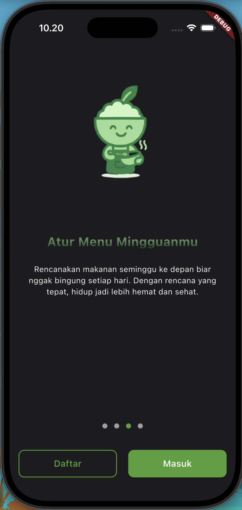
  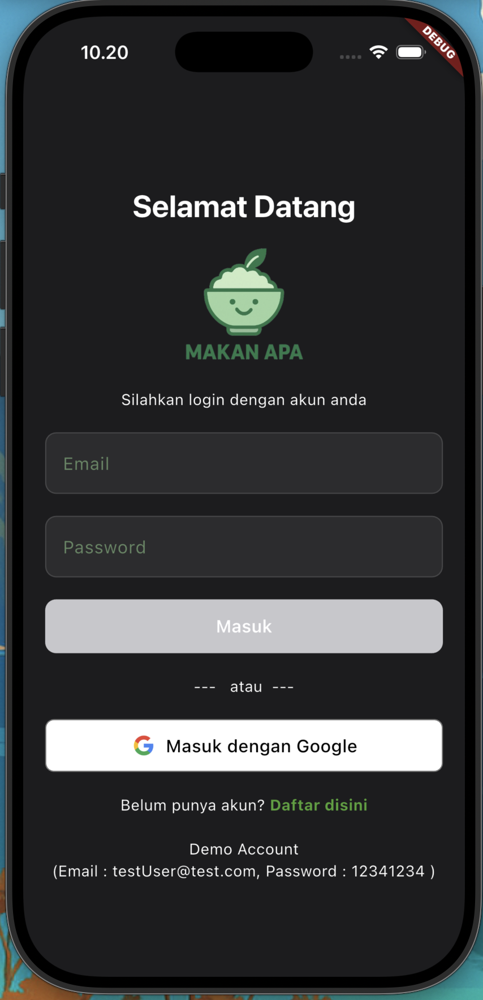
  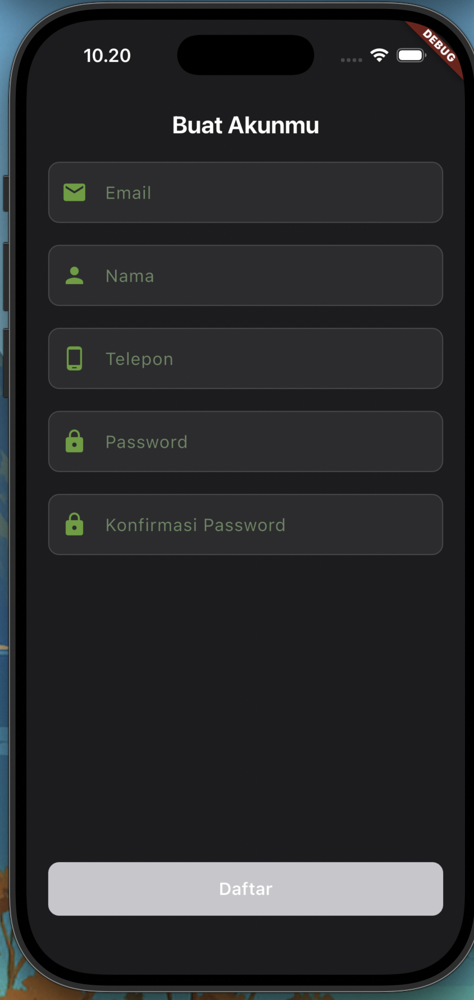
</p>

---

#### 📊 Dashboard & Meal Planning
<p align="center">
  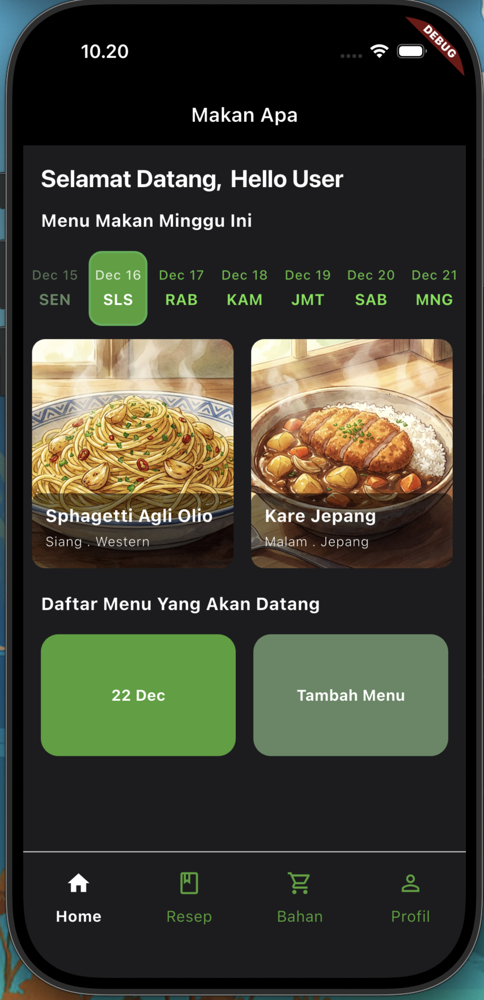
  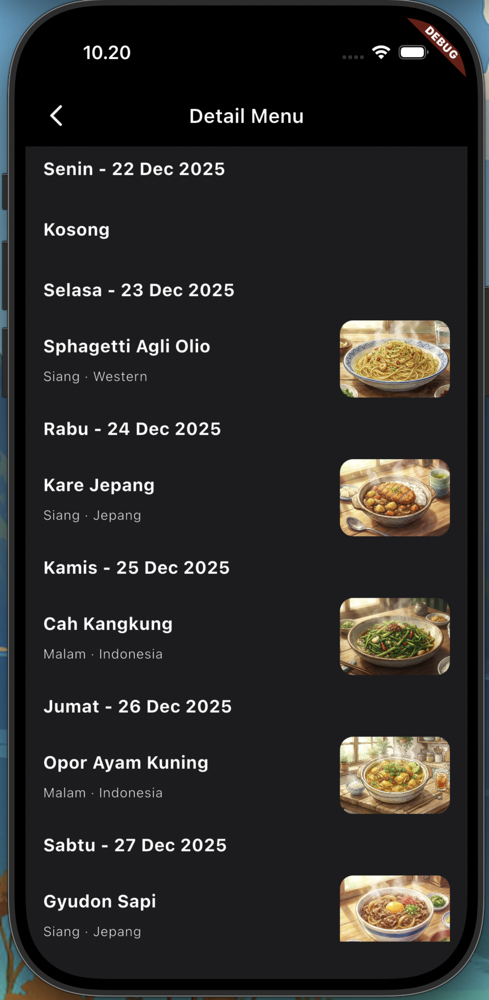
  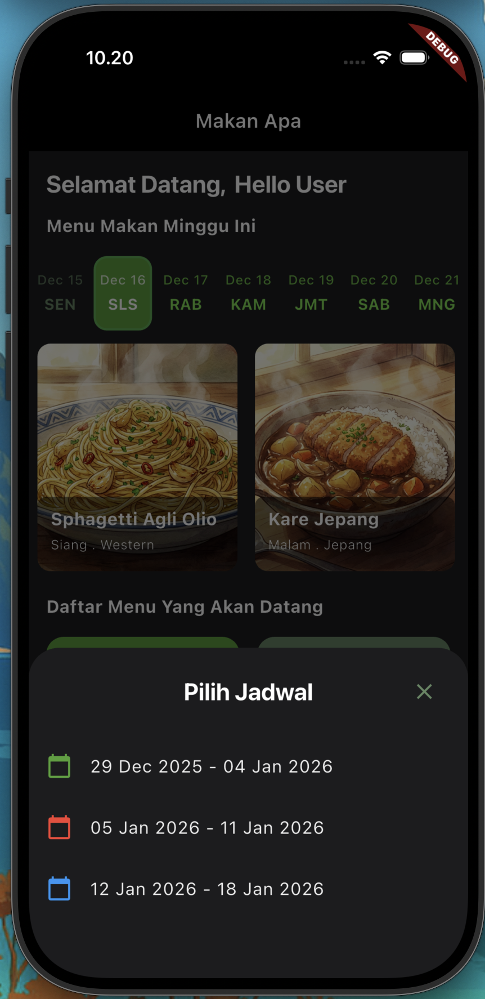
</p>

<p align="center">
  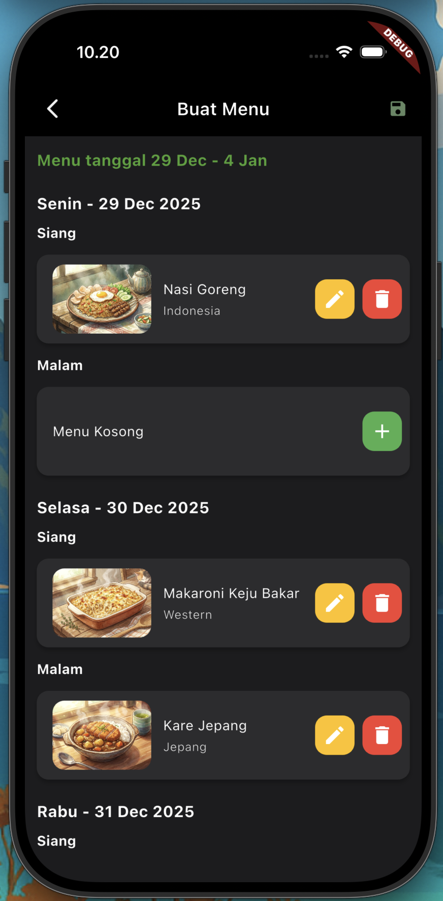
  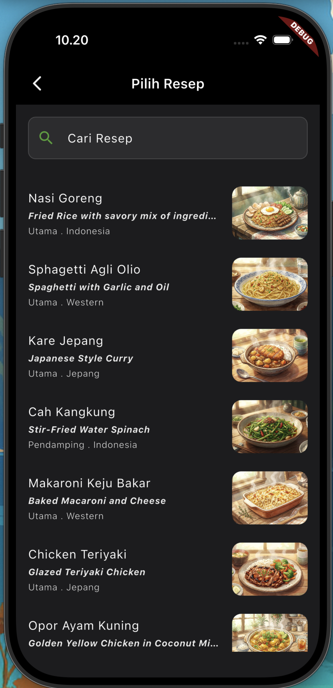
</p>

---

#### 🍳 Recipe Library
<p align="center">
  
  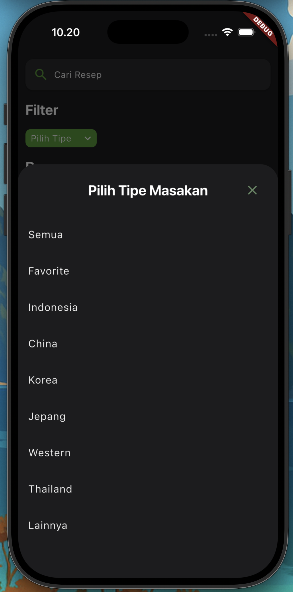
  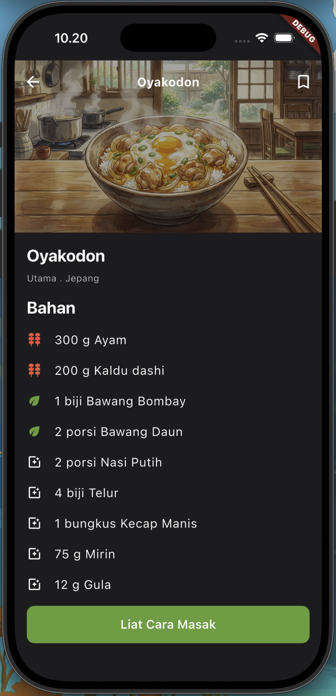
</p>

<p align="center">
  
  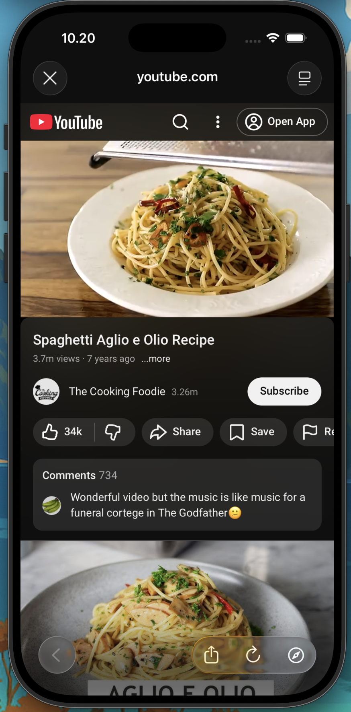
</p>

---

#### 👤 Profile & Settings
<p align="center">
  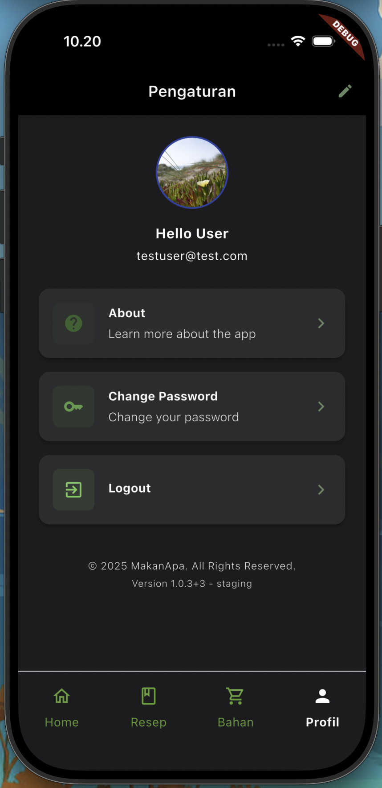
  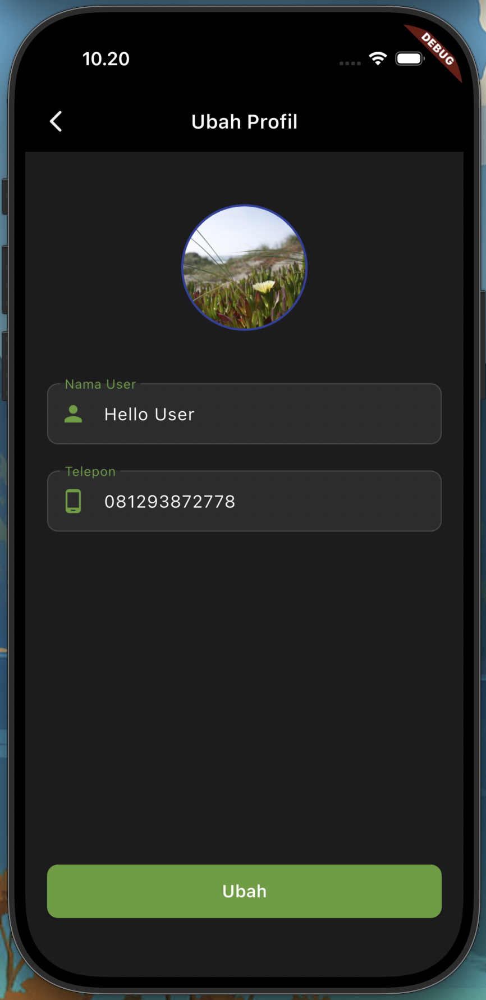
  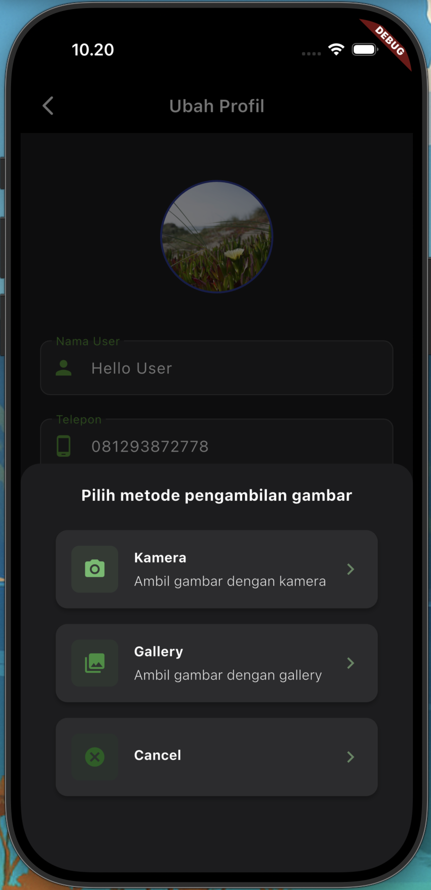
</p>

<p align="center">
  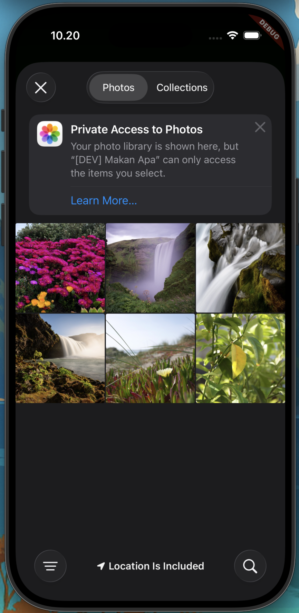
  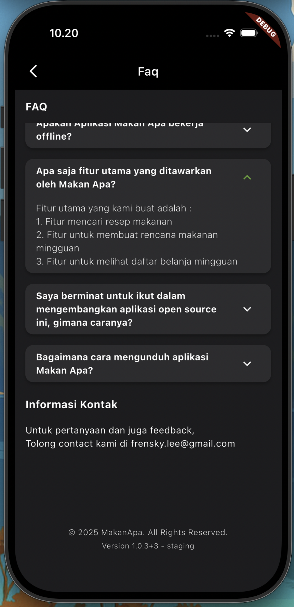
  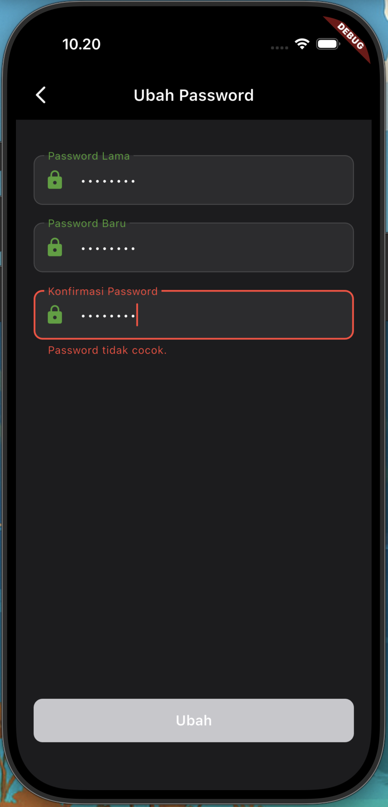
</p>

---

#### 🛒 Shopping List
<p align="center">
  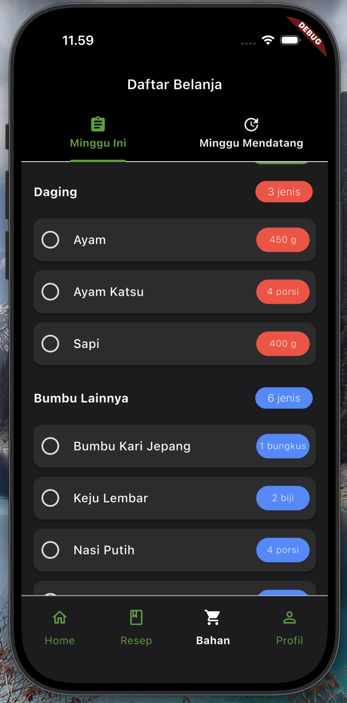
  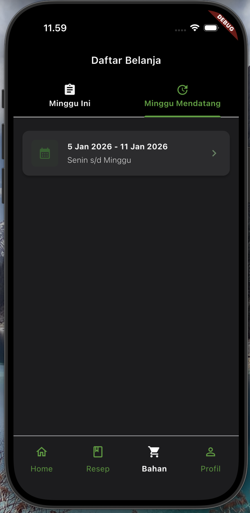
  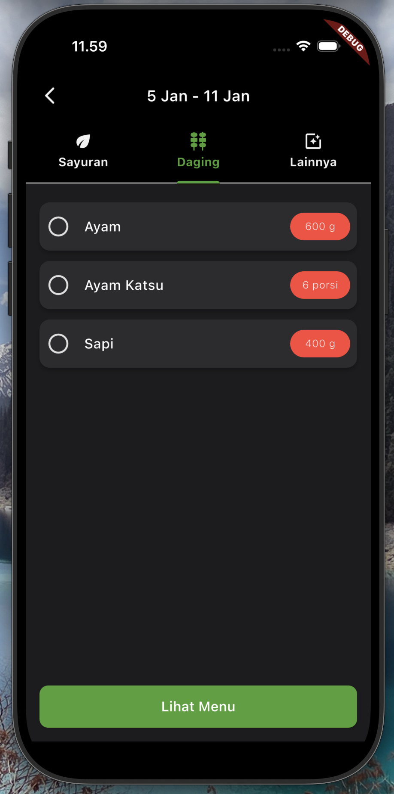
</p>

</details>

## 3. Tech Stack

### 📱 Core Framework
- Flutter 3.35.6
- Dart 3.9.2
- DevTools 2.48.0

### 🏗️ State Management
- **Riverpod** (Authentication, Profile, Dashboard)
- **Bloc** (Recipe features)

> Hybrid approach demonstrates proficiency in multiple state management patterns.

### 🗄️ Backend & Database
- **Supabase**
  - PostgreSQL with RLS
  - Edge Functions (AI-assisted)
  - Auth (JWT-based)
  - Storage (images & assets)

### 💾 Local Storage
- **Isar Community** – reactive offline-first database

### 🌐 Networking
- **Dio** (with interceptors & logging)
- **Chucker** (disabled for now)

### 🔧 Dependency Injection
- **Riverpod** (type-safe DI)

### 🤖 AI Integration & Data Seeding
- **n8n workflows** for recipe generation, ingredient lists, and food images

### 📦 Key Packages & Tools
- go_router, cached_network_image, flutter_hooks, hooks_riverpod
- freezed, build_runner, json_serializable
- dartz, equatable
- flutter_dotenv, firebase_auth, mockito

---

## 4. Architecture Overview

### Clean Architecture with Feature-First Structure

This project follows **Clean Architecture** principles using a **feature-first** approach, making each feature self-contained and the codebase easy to navigate.

```text
lib/
├── core/              # Shared utilities, theme, widgets, configs
├── features/          # Feature modules
│   ├── home/
│   │   ├── data/          # API & DB implementations
│   │   ├── domain/        # Business logic & interfaces
│   │   ├── presentation/  # UI, controllers, state
│   │   └── provider/      # Dependency injection
│   ├── recipe/
│   ├── profile/
│   └── ...
└── shared/            # Cross-feature shared code
```

### Three-Layer Architecture

**Domain Layer** (Pure Business Logic)
- Repository interfaces
- Domain models
- Use cases

**Data Layer** (Data Management)
- Repository implementations
- Remote data sources (Supabase API)
- Local data sources (Isar DB)
- DTOs and entity models

**Presentation Layer** (UI)
- Screens and components
- Controllers (Riverpod/Bloc)
- UI state management

### Offline-First Data Flow

```
UI → Controller → Repository → Remote API → Save to Isar DB
                                                    ↓
                                              Stream Event
                                                    ↓
                  Controller ← Listen to Stream ← Isar DB
                       ↓
                  Update State
                       ↓
                  UI Re-renders
```

**How it works:**
1. App loads cached data from Isar instantly (offline support)
2. Fresh data fetched from API and saved to Isar
3. Isar emits stream event on data change
4. Controller listens and updates UI automatically

---

## 5. Setup

<details>
<summary>Show Detailed Setup</summary>

### 🛠 Prerequisites
- Flutter SDK 3.35.6
- Dart SDK 3.9.2
- Make (for code generation)

### 📥 Installation
```bash
git clone https://github.com/FrenskyOey/MakanApa.git
cd MakanApa/makanapa
flutter pub get
```

### 🔐 Environment Configuration
- Copy `environment.env.example` → `environment_staging.env` & `environment_production.env`
- Fill required keys (Supabase URL/Anon Key, Firebase credentials)

### ⚡ Supabase Setup
1. Create a Supabase project
2. Apply SQL schema from `/master/`
3. Deploy Edge Functions from `/master/`
4. Add `SUPABASE_URL` & `SUPABASE_ANON_KEY` to `.env`

### 🔥 Firebase Setup
- Add `google-services.json` (Android) & `GoogleService-Info.plist` (iOS)

### 🏗 Code Generation
```bash
make build_runner
```

### 🚀 Run App
**Staging:** `flutter run --flavor staging -t lib/main_staging.dart`  
**Production:** `flutter run --flavor production -t lib/main_prod.dart`

</details>

---

## 6. Design Decisions

### Why Clean Architecture?
- **Scalability** – Easy to add new features without impacting existing code
- **Testability** – Each layer can be tested independently with clear boundaries
- **Maintainability** – Changes in one layer don't ripple through the entire codebase
- **Team Collaboration** – Clear structure makes it easier for multiple developers to work simultaneously

### Why Hybrid State Management (Riverpod + Bloc)?
- **Demonstrates Versatility** – Shows proficiency in multiple modern Flutter patterns
- **Practical Flexibility** – Riverpod for simple MVVM patterns, Bloc for complex MVI flows
- **Interview Ready** – Accessible to developers familiar with either approach
- **Learning Showcase** – Highlights deep understanding of Flutter state management evolution

### Why Isar Database?
- **Reactive Streams** – Native stream support perfect for offline-first architecture
- **Developer Experience** – Built-in web inspector makes debugging intuitive
- **Performance** – Fast NoSQL database optimized for mobile
- **Type Safety** – Strong typing with code generation reduces runtime errors

### Why Supabase over Firebase?
- **PostgreSQL Power** – Full relational database capabilities with RLS security
- **Edge Functions** – Serverless API with better AI code generation support
- **Open Source** – Self-hostable with no vendor lock-in
- **Cost Effective** – Generous free tier for portfolio projects

### Why Feature-First Structure?
- **Screaming Architecture** – Folder structure clearly communicates app features
- **Modularity** – Each feature is self-contained and independently deployable
- **Scalability** – Easy to add, remove, or modify features without affecting others
- **Team Organization** – Features can be owned by different team members

---

## 7. Limitations

- Offline insert/update not supported yet
- Android/iOS only (no web)
- Currently supports only Indonesian language
- Forgot password (Deep Links) disabled
- Plan editing/deleting not implemented
- Push notifications not yet integrated
- Firebase Crashlytics & Analytics not configured

---

## 8. Future Improvements

- Full CRUD for plans
- Enhanced recipe selection UI
- Push notifications
- Complete forgot password flow
- CI/CD pipelines
- Expand more unit/widget tests

---

## 9. Contact & License

**Email:** [frensky.lee@gmail.com](mailto:frensky.lee@gmail.com)  
**LinkedIn:** [Frensky Oey](https://www.linkedin.com/in/frensky-oey-8aaa3926/)  

**License:** MIT License

<div align="center">

### ⭐ If you find this project helpful, please consider giving it a star!

**Made with ❤️ using Flutter**

</div>
